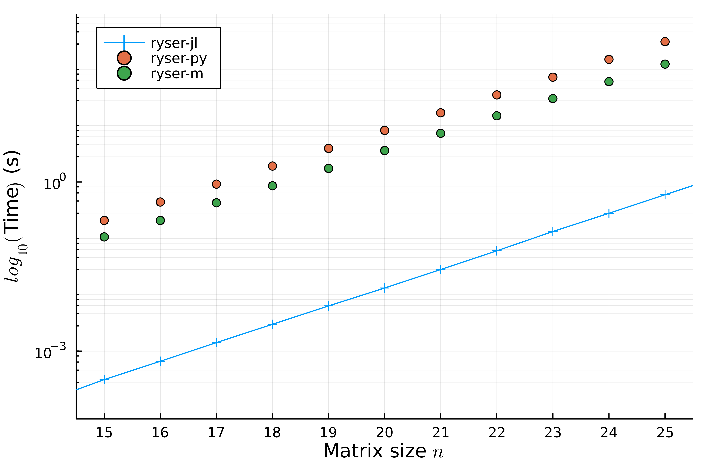

# Benchmarks

## Why Julia?

When simulating a boson sampling experiment, via for instance [`cliffords_sampler`](@ref) or
[`noisy_sampler`](@ref), the most time consuming part is the computation of the
probabilities. Indeed, the probability to detect the state ``|l_1,…,l_m>`` at
the output of an interferometer ``\hat{U}`` from an input state ``|ψ_{in}> = |k_1,…,k_m>``
is related to the permanent of ``U`` through

```math
|<n_1,…,n_m|\hat{U}|ψ_{in}>|^2 = \frac{|Perm(U)|^2}{k_1!… k_m! l_1! … l_m!}.
```

Having an intensive usage of the [`Ryser's`](https://en.wikipedia.org/wiki/Computing_the_permanent#Ryser_formula) algorithm to compute such probabilities,
we compare here the running time of the latter algorithm from different implementations to compute the permanent of Haar distributed random matrices of dimension `n`:


