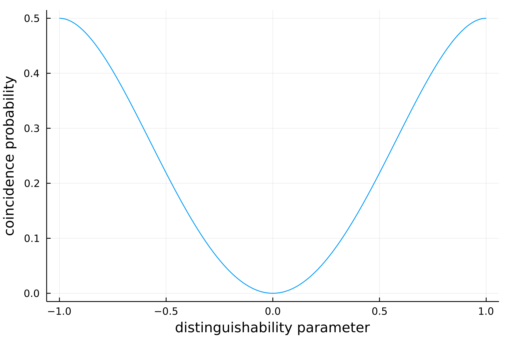

# Computing the photon counting statistics

Given `n` photons among `m` modes, one can build several configurations. All
of those possible arrangements can be retrieved by using [`output_mode_occupation`](@ref)

    julia> n = 2;

    julia> m = 2;

    julia> output_mode_occupation(n,m)
    4-element Vector{Any}:
    [1, 1]
    [1, 2]
    [2, 1]
    [2, 2]

giving a vector of the possible mode assignement lists. We propose here some functions
that generate all the associated probabilities to end up in one of such configuration
from an [`Input`](@ref) and an [`Interferometer`](@ref). In the following, each
generating probability distribution is indexed as [`output_mode_occupation`](@ref),
that is, `p[i]` gives the probability to obtain the outcome `output_mode_occupation[i]`.

## Theoretical distribution

We propose here to see the effect of partial distinguishability when two photons
interfere through a 1:1 [`BeamSplitter`](@ref)

    julia> n = 2; # photon number

    julia> m = 2; # mode number

    julia> B = BeamSplitter(1/sqrt(2));

    julia> proba_bunching = Vector{Float64}(undef, 0);

    julia> for distinguishability_param in 0.0:0.01:1.0
           input = Input{OneParameterInterpolation}(first_modes(n,m), distinguishability_param)
           p_theo = theoretical_distribution(input=input, interf=B)
           push!(proba_bunching, p_theo[2])
           end

where we have stored in `proba_bunching` the probabilities to get one photon in each
output port of the beam splitter (see above).

## Noisy distribution

As for [`noisy_sampler`](@ref), we sometimes want to take into account imperfections
in the experimental realisation of a circuit. One can use [`noisy_distribution`](@ref)
to compute the probabilities to end up in each configuration given by [`output_mode_occupation`](@ref)
from a defined input when using a lossy interferometer

    julia> n = 3;

    julia> m = 5;

    julia> distinguishability_param = 0.7;

    julia> my_reflectivity = 0.7;

    julia> my_input = Input{OneParameterInterpolation}(first_modes(n,m), distinguishability_param);

    julia> my_interf = RandHaar(m);

    julia> res = noisy_distribution(input=my_input, interf=my_interf, reflectivity=my_reflectivity)
     3-element Vector{Any}:
     [0.030092342701336063, 0.009174672025065295, 0.012301444632816206, 0.008261320762511275, 0.00825343245181492, 0.009174672025065295, 0.0015318257468957183, 0.007037230327501444, 0.0034542128581951815, 0.0032779849423985887  …  0.01245307508063033, 0.00543392525722553, 0.010053183825728736, 0.013575124678493963, 0.011494371794022762, 0.009403036769288563, 0.009156238120536536, 0.015161445820062795, 0.011494371794022764, 0.04819898039534371]
     [0.023551358197813715, 0.008260895456533175, 0.012221654757509451, 0.012336452058889868, 0.011712852102797554, 0.008260895456533173, 0.0013590732227078874, 0.007212741596498194, 0.0036595492225577186, 0.003983666401759253  …  0.00382520988349487, 0.004571718465896123, 0.009290013877211057, 0.018492288077608613, 0.016830450331890665, 0.01355520468409837, 0.009082179316484165, 0.016223969372706714, 0.016830450331890665, 0.03772226919407445]
     [0.05140000000000507, 0.013849999999999604, 0.016499999999999498, 0.0007700000000000014, 0.0024400000000000055, 0.014479999999999578, 0.0023500000000000053, 0.008769999999999811, 0.0016500000000000037, 0.0005500000000000008  …  0.018739999999999406, 0.005969999999999925, 0.006519999999999903, 0.0058099999999999315, 0.0018300000000000041, 0.002200000000000005, 0.012819999999999646, 0.016089999999999514, 0.0017100000000000038, 0.08629999999999924]

Notice that `res` is a three-component vector containing three probability distributions. In fact,
[`noisy_distribution`](@ref) takes three additional arguments: `exact`, `approx` and `samp`.
By default, those optional parameters are set to `true` meaning that we actually compute three
distributions:

    julia> p_exact = res[1];

    julia> p_approx = res[2];

    julia> p_samp = res[3];

The first one is the noisy version of [`theoretical_distribution`](@ref), the second distribution
is computed such that the probabilities are truncated by neglecting the highest interference terms.
The last distribution is computed thanks to a Metropolis sampler that samples from the exact distribution.

One can allow the computation of the sampled distribution only, by setting `exact=false, approx=false` when calling `noisy_distribution`.    
